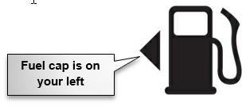
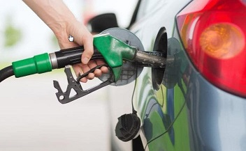

# How to Refuel a Car

Refueling is an essential car maintenance task. As ordinary as it may seem, it requires a thorough understanding and precise execution. Before embarking on your refueling journey, familiarize yourself with this document. It starts with the fundamental preliminary considerations and then provides in-depth instructions for error-free and efficient refueling.

## Preliminary considerations

Upon arriving at the petrol station, consider these 3 points that are vital for successful refueling.
1.	What fuel type does your car take?

    Knowing the fuel type suitable for your car is necessary, because the wrong fuel can damage the engine. To check which type  of fuel you need, consult your car handbook. The fuel type is also indicated on the inside of the fuel tank cap.

2.	Which side of the car is the fuel cap located?

    Knowing this is necessary for correctly pulling up to a pump. To check which side the fuel cap is on without leaving your car, look closely at the fuel gauge on your dashboard. Near the gauge, there is a fuel pump icon similar to the following:
    
    
    
    The triangle in this icon indicates the location of the fuel cap relative to the driver’s position at the wheel.
    
3.	How does the fuel cap open?
    Some fuel caps open with the car key, others open by pulling a lever from within the car. To check which technology your car manufacturer implemented, consult your car handbook.
    
## Refueling the car

Having considered all of the above points, proceed with the following steps.

1.	Pull up at the suitable fuel pump by making sure that:

- The fuel cap is facing the pump

- The car side is about half a meter from the pump

- The car nose is lined up with the end of the pump.

2.	Pull the handbrake on, shift into neutral, and turn off the engine.

3.	Open the fuel cap.

4.	If the pump has a card machine, insert your card into the card slot and follow the on-screen instructions. 
    If your pump does not have a card machine, check the pump number, approach a pump station assistant, and inform him of the pump number and the required volume of petrol.

5.	Lift the pump handle and insert the nozzle into the fuel cap.

6.	Once the nozzle is in the hole firmly, squeeze the handle, as shown below:

    

    Fuel will start flowing out of the pump into your fuel tank.

7.	Continuously monitor the counter display for both price and volume.

8.	Continue fueling up until you arrive at a certain price or until the fueling automatically stops, which indicates that your fuel tank is now full.

9.	Return the nozzle to the pump.

10.	Put the fuel cap back on.

11.	If you have paid with the card, wait for the receipt.
    To pay in cash, proceed to the checkout.

12.	Return to your car and start the engine. Check carefully for pedestrians and other cars, then pull away very slowly.

You have now successfully completed refueling your car. In future, make sure to repeat this process exactly as described in this manual.
